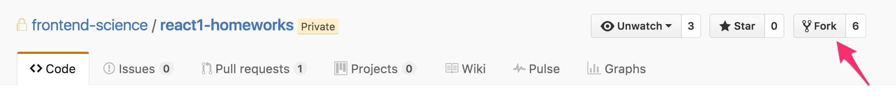
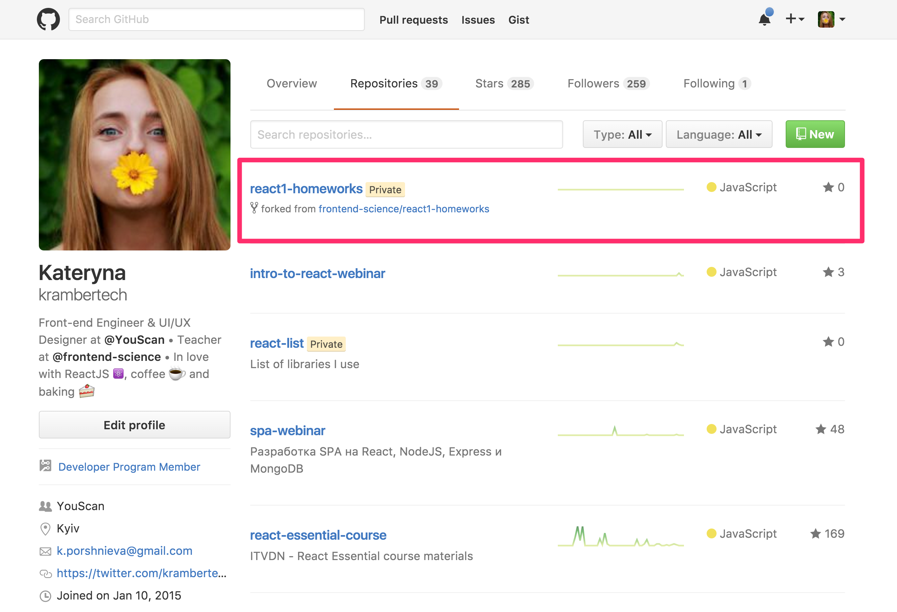
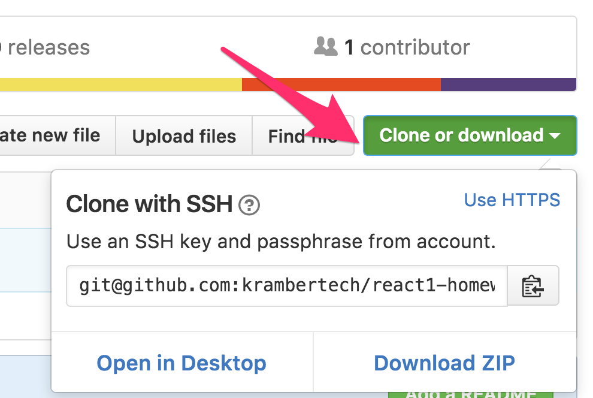
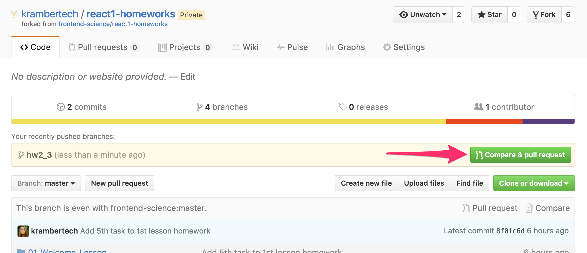
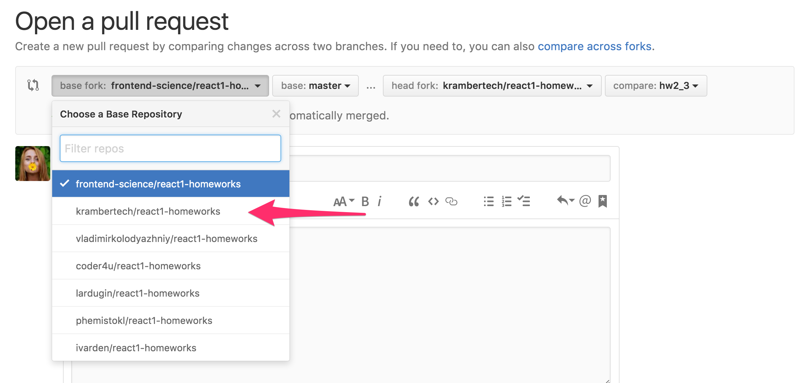
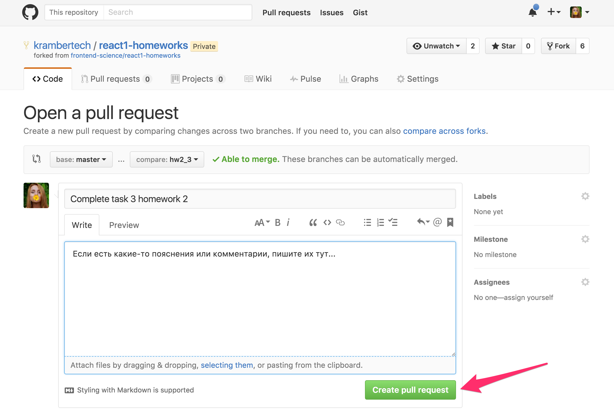
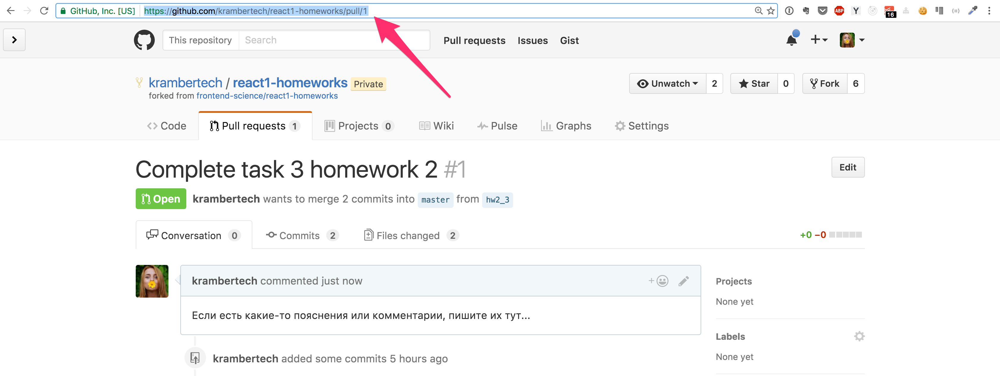
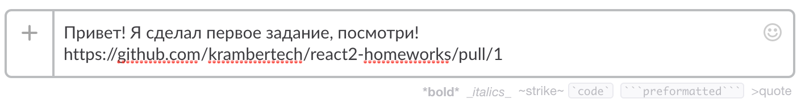
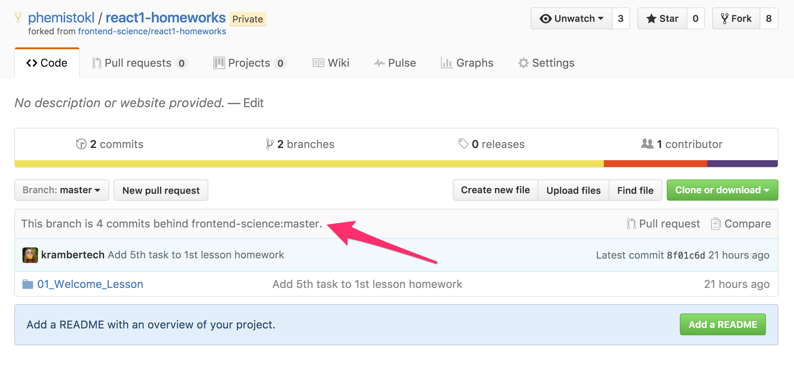
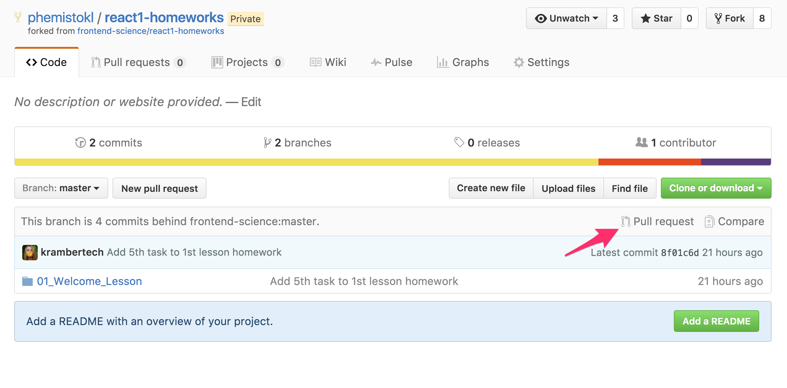

# Как выполнять задания

### Небольшие требования и пожелания:

- Следите за *code style*. Чтобы не получать комментариев по поводу отступов и пробелов :blush: [Вот](https://github.com/airbnb/javascript) хороший style guide. Следите, чтобы ваш код был читабельным и рабочим.
- Прикладывайте скриншот к заданию прямо в pull-реквест, если не знаете как - почитайте о [Markdown](https://guides.github.com/features/mastering-markdown/). В идеале, выкладывать результат на [Github Pages](https://pages.github.com/) и вставлть ссылочку.
- Смотрите, чтобы в консоли не было warning'ов и ошибок.
- Задавайте вопросы! Если вам говорят, что нужно так, а вы не понимаете почему, спрашивайте!
- И не расстраивайтесь, если приходится переделывать по многу раз и ваши работы не принимаются с первого раза! Это только плюс, ведь именно так вы и учитесь. 

### 1. Сделайте Fork этого репозитория



### 2. В списке ваших репозиториев появится новый, откройте его



### 3. Склонируйте его себе на компьютер

❓ **[Как склонировать репозиторий](https://git-scm.com/book/it/v2/Git-Basics-Getting-a-Git-Repository)**



```
git clone <link here>
cd react2-homeworks
```

### 4. Создайте новую ветку

❓ **[Ветвление в Git - Приёмы работы с ветками](https://git-scm.com/book/ru/v1/%D0%92%D0%B5%D1%82%D0%B2%D0%BB%D0%B5%D0%BD%D0%B8%D0%B5-%D0%B2-Git-%D0%9F%D1%80%D0%B8%D1%91%D0%BC%D1%8B-%D1%80%D0%B0%D0%B1%D0%BE%D1%82%D1%8B-%D1%81-%D0%B2%D0%B5%D1%82%D0%BA%D0%B0%D0%BC%D0%B8)**

Создайте новую ветку для одного из заданий работы `hw<номер работы>_<номер задания>`.

Например, мы хотим выполнить 3е задание домашней работы ко 2му уроку. Создадим тогда ветку `hw2_3`.

`git branch hw2_3`

Далее, перейдем в созданную ветку:

`git checkout hw2_3`

### 5. Выполните задание

❓ **[Запись изменений в репозиторий](https://git-scm.com/book/ru/v1/%D0%9E%D1%81%D0%BD%D0%BE%D0%B2%D1%8B-Git-%D0%97%D0%B0%D0%BF%D0%B8%D1%81%D1%8C-%D0%B8%D0%B7%D0%BC%D0%B5%D0%BD%D0%B5%D0%BD%D0%B8%D0%B9-%D0%B2-%D1%80%D0%B5%D0%BF%D0%BE%D0%B7%D0%B8%D1%82%D0%BE%D1%80%D0%B8%D0%B9)**

В репозитории есть папки под каждый урок. В каждой из таких папок находятся папки под каждое из заданий урока.

Теперь сделайте то, что требуется в задании.

Добавьте все ваши изменения.

`git add .`

Сделайте коммит

`git commit -m "Complete task 3 homework 2"`

Сделайте `push`

`git push origin hw2_3`

### 6. Создайте pull-реквест

В репозитории у вас должно появится такое сообщение:



Нажмите "Compare & pull request".

Если такое сообщение не появилось, нажмите на вкладку "branches", выберите нужную и нажмите "New pull request".

⚠️ Обязательно в качестве **base fork** выберите **СВОЙ** fork! ⚠️



Далее введите название для pull-реквеста. По желанию можете добавить комментарий. И нажимайте на кнопку "Create pull request".



### 7. Почти готово

Все, почти готово! Осталось только сбросить ссылочку на пулл-реквест своему ментору по этой домашней работе.





### 8. Обновление своего fork'a

Когда в оригинально репозитории будут появляться изменения, вам нужно будет обновлять свой fork. Увидеть появились ли какие-то изменения вы можете на странице своего репозитория:



Если вы видете такое сообщение, вам нужно смерджить изменения оригинального репозитория в свой. Это можно сделать  нажав прямо там же кнопку "Pull request".



Так же это можно сделать через терминал:

```
git checkout master
git pull https://github.com/frontend-science/react2-homeworks.git master
git push origin master
```

-

Теперь точно все!

Удачи в выполнении заданий 😉

*К.*
